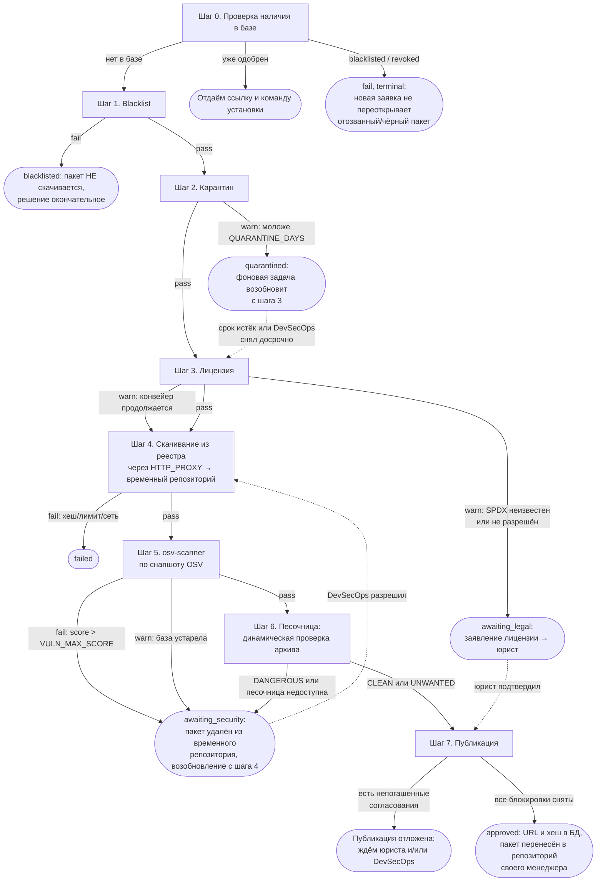
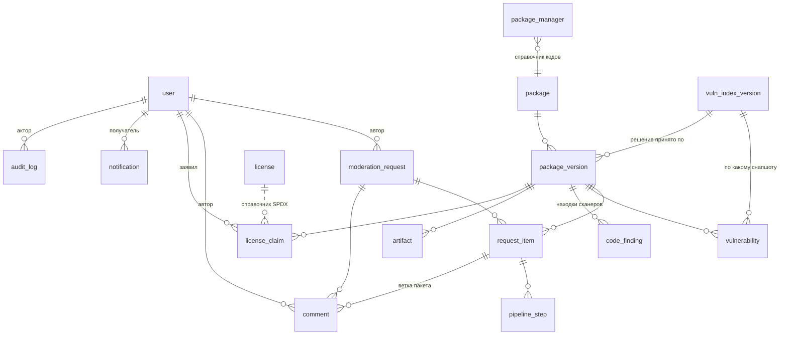

# Архитектура

## Стек: перенос на Go завершён

Backend переписан на Go — ради единства технического стека с соседними
DevSecOps-сервисами организации (`sentrix`, `oakshield`/DSO-track, `vm.service`).
Python-версия погашена и поднимается только профилем `python` на случай отката;
история переноса — [`docs/migration-to-go.md`](migration-to-go.md).

| Компонент | Было (Python-прототип) | Стало | Причина замены |
| --- | --- | --- | --- |
| Backend/API | FastAPI | Go + chi + pgx (без ORM) | единство с sentrix/oakshield/vumana |
| Воркер конвейера | Celery | воркер на Go | Celery — Python-специфичен |
| Очередь | Redis (брокер Celery) | **Postgres**: `FOR UPDATE SKIP LOCKED` + `LISTEN/NOTIFY` | Redis ≥7.4 — SSPL, не permissive-OSS (правило oakshield). Отдельный брокер не понадобился вовсе: состояние очереди и так живёт в базе, и отдельное хранилище означало бы два источника правды о том, взят ли пакет в работу |
| Миграции БД | Alembic | golang-migrate, формат `NNNN_name.up/down.sql` | формат sentrix — самый стандартный из референсов |
| Карантинное хранилище | MinIO (S3) | **репозиторий в самом артефактори** | MinIO — AGPL, лицензионный риск (правило oakshield). Заменено не другим объектным хранилищем, а артефактори: файлы и так едут только туда, и отдельная система со своими ключами, доступом и резервным копированием себя не окупала |
| Frontend (React+TS+Vite) | — | без изменений | уже соответствует референсам (ближе всего к oakshield) |
| Auth (OIDC/Keycloak + RBAC) | — | без изменений | уже соответствует референсам |
| PostgreSQL, схема БД, конвейер шагов, роли | — | без изменений по существу | домен уже спроектирован и провалидирован |
| Конфигурация (Artifactory/sandbox/политики блокировки/пороги) | `.env` + рестарт, только чтение в UI | `.env` + перезагрузка политик без рестарта (`POST /api/v1/admin/reload`) | см. `docs/configuration-model.md`: что переезжает в БД, а что остаётся bootstrap-исключением (DSN БД, `FERNET_KEY`) |

## Состав

| Компонент | Роль |
| --- | --- |
| `nginx` | единая точка входа: SPA + проксирование `/api` |
| `web` | сборка SPA (React + TypeScript, Vite), отдаётся через nginx |
| `api-go` | HTTP API целиком: заявки, статусы, решения, админка, GitLab, отчёты |
| `worker-go` | конвейер проверок, скачивание, публикация, регламентные задачи |
| `migrate-go` | разовая задача: накатывает схему и завершается |
| `db` | PostgreSQL 16 — состояние всех шагов конвейера и очередь конвейера |
| `keycloak` | IdP (профиль `sso`) |
| `nexus` | целевой артефактори (профиль `nexus`) |
| `api`, `worker`, `beat`, `redis` | python-версия, погашена; поднимается только профилем `python` для отката |

Отдельного объектного хранилища (`minio`) больше нет: промежуточная зона и
отчёты живут репозиториями в самом артефактори. Очередь конвейера — в Postgres
(`FOR UPDATE SKIP LOCKED` + `LISTEN/NOTIFY`), поэтому брокер (`redis`) нужен
только погашенной python-версии.

## Конвейер проверок

Шаги выполняются по порядку. Каждый шаг сохраняет результат (`pass` / `warn` / `fail`),
объяснение на русском и время. Первый `fail` останавливает конвейер: дальнейшие шаги помечаются
`skipped` с указанием, чем остановлено.

Исключение одно — шаг 3. Несогласованная лицензия конвейер **не** останавливает: пакет уходит на
скачивание и проверку уязвимостей, чтобы DevSecOps увидел его сразу, а не после решения юриста.
Публикация при этом не состоится, пока не снята каждая блокировка.



### Что делает каждый шаг

| Шаг | Код | Что проверяет | Остановка |
| --- | --- | --- | --- |
| 0 | `db_check` | версия уже в базе — три исхода: `approved` / `blacklisted` / `revoked` | `approved` → `pass` + terminal (ссылка и команда установки); `blacklisted`/`revoked` → `fail` + terminal |
| 1 | `blacklist` | правила `BLACKLIST_FILE` (точное имя, glob, диапазон версий) | `fail`, пакет **не скачивается**; снять может только правка blacklist |
| 2 | `quarantine` | дата публикации из реестра против `QUARANTINE_DAYS` | `warn` → `quarantined`; фоновая задача возобновляет с шага 3 |
| 3 | `license` | SPDX из метаданных против `ALLOWED_LICENSES_FILE` | `warn` → `awaiting_legal`, но конвейер **идёт дальше**: согласования юриста и DevSecOps параллельны |
| 4 | `download` | скачивание **напрямую из реестра** через `HTTP_PROXY`, сверка контрольной суммы, лимит размера; пакет кладётся во временный репозиторий артефактори | `fail` при несовпадении хеша или превышении лимита |
| 5 | `vuln_scan` | osv-scanner по локальному снапшоту OSV | `fail` при `score > VULN_MAX_SCORE`, `warn` если снапшот устарел |
| 6 | `sandbox_scan` | архив уходит в песочницу, оттуда — вердикт и отчёт | `DANGEROUS` → `fail`; `UNWANTED` → `pass` с пометкой в отчёте; песочница недоступна → `warn` → `awaiting_security` |
| 7 | `publish` | перенос из временного репозитория в репозиторий своего менеджера, запись URL и хеша | откладывается, если есть непогашенные согласования; `fail` при недоступности артефактори |

Шаги `banner_scan` (политические баннеры, YARA) и `sast_scan` (semgrep) **сняты с
конвейера** по решению заказчика. Их реализация сохранена
(`backend-go/internal/scanners`, `pipeline.RetiredSteps`), а коды шагов остаются
допустимыми значениями в базе: строки `pipeline_step` с ними лежат у каждой
заявки, проверенной до снятия, и карточка такой заявки обязана читаться. Возврат
в строй — это добавление шага обратно в `Steps`/`StepCodes` плюс миграция.

`UNWANTED` пропускается намеренно: это «нежелательное, но не вредоносное» —
рекламные модули, майнеры в примерах, агрессивная телеметрия. Блокировать по
нему значило бы звать DevSecOps на каждый второй пакет; пометка в отчёте
оставляет решение тому, кто пакет заказал.

Балл уязвимости нормализован к диапазону 0..100 (CVSS × 10), поэтому `VULN_MAX_SCORE=80`
соответствует CVSS 8.0.

### Сверка схемы с кодом

Допустимые значения статусов и результатов шагов заданы дважды: в коде
(`internal/domain/enums.go`, `app/db/enums.py`) и в CHECK-ограничениях базы, которые ставит
миграция. Столбцы поздних миграций (`request_item.resume_from_step`, `attempts`,
`package_version.security_override_*`) — тоже условие работы кода. Разойтись это может
запросто: миграцию забыли накатить, накатили не тот набор из двух (Alembic / golang-migrate),
откатили один и не откатили другой.

Снаружи расхождение выглядит не как «схема устарела», а как случайная ошибка при нажатии
кнопки. Так и было в бою: закрытие заявки отвечало «Заявка не закрыта» (CHECK не разрешал
статус `cancelled`), а решение DevSecOps — «Решение не применено» (в базе не было столбца
`resume_from_step`, и постановка пакета в очередь падала).

Поэтому сверка сделана в трёх местах:

* **при старте api-go** — пробелы попадают в лог с уровнем ERROR и с именем миграции
  (`repo.MissingSchemaObjects`). Не фатально: сервис обязан отвечать health и отдавать чтение
  даже на неполной схеме;
* **командой `moderation schema`** — тот же отчёт для человека, код возврата 1 при пробелах,
  так что её можно поставить в проверку перед деплоем;
* **в ответе API** — ошибки уровня схемы (SQLSTATE 23514 / 42703 / 42P01) возвращаются с
  прямым текстом «Схема базы не соответствует версии сервиса» и указанием, что покажет
  недостающее (`api.schemaError`). Имя ограничения или столбца — метаданные схемы, а не данные
  пользователя, поэтому показывать их можно.

Источник списка значений — те же константы, которыми пользуется код, поэтому сверка не может
разойтись с ним: новое значение появляется в enum'е и сразу попадает в проверку. Значение
должно быть разрешено КАЖДЫМ CHECK на столбце — после накатывания одного набора миграций
поверх базы, созданной другим, рядом может остаться второе ограничение со старым списком.

У python-версии та же сверка сделана тестом (`tests/unit/test_migration_constraints.py`):
он разбирает миграции Alembic и сравнивает списки с константами кода.

Набор golang-migrate накатывается руками (в `docker-compose.yml` мигратора для него нет),
поэтому все его `*.up.sql` написаны **безопасно повторяемыми**: `ADD COLUMN IF NOT EXISTS`,
`CREATE TABLE/INDEX IF NOT EXISTS`, а ограничения снимаются через `DROP CONSTRAINT IF EXISTS`
сразу по двум именам — своему и тому, которое даёт Alembic. Значит, «накатить весь набор» —
безопасная операция: уже применённые миграции ничего не сломают, и не нужно выяснять, какие
именно пропущены (а `moderation schema` это всё равно покажет).

### Возобновление после ручного решения

| Из состояния | Кто снимает | Возобновляется с шага |
| --- | --- | --- |
| `quarantined` | фоновая задача по истечении срока либо DevSecOps досрочно | 3 (`license`) |
| `awaiting_legal` / `license_claimed` | юрист подтвердил лицензию | 4 (`download`) |
| `awaiting_security` | DevSecOps разрешил публикацию | 4 (`download`) |

Возобновление с шага 4 после решения DevSecOps не случайно: при `fail` на шаге 5
пакет из временного репозитория удаляется сразу, поэтому артефакт скачивается
заново.

**Решение снимает блокировку не только для той заявки, где было нажато.** Если несколько
заявок (`moderation_request`, в том числе от разных авторов) ссылаются на одну и ту же
`package_version`, решение по карантину/лицензии/безопасности применяется сразу ко всем их
`request_item`, ожидающим того же шага (`siblings_awaiting`/`_apply_to_siblings`,
`app/services/decisions.py`) — не только к тому пакету, на карточке которого его приняли. Это
осознанное поведение: версия пакета одна на всех, и вопрос про её лицензию/уязвимость не имеет
смысла решать по второму разу для второй заявки. При проектировании UI очередей (`decisions.py`,
`_queue`) и уведомлений это должно быть видно — иначе пользователь, принявший решение по одной
заявке, не поймёт, почему у него пропали ещё N заявок из очереди.

Решение роли гасит блокировку своего шага — его строка отмечается пройденной. Это обязательно:
возобновление идёт с шага 4, сам шаг лицензии повторно не выполняется, и без явной отметки
публикация ждала бы вечно. По той же причине гасится досрочно снятый карантин — повторный прогон
шага 2 дал бы тот же вердикт, ведь дата публикации не изменилась.

## Жизненный цикл артефакта в артефактори

Пакет всё время лежит в артефактори, но в двух разных репозиториях: временном
(`ARTIFACT_REPO_STAGING`) — пока идут проверки, и репозитории своего менеджера
(`ARTIFACT_REPO_<MANAGER>`) — после того, как все пройдены. Временный
репозиторий — карантинная зона, а не архив.

- пакет появляется во временном репозитории на шаге скачивания, по пути
  `{manager}/{name}/{version}/{filename}`;
- после публикации переносится в репозиторий своего менеджера. По возможности —
  `api/move` самого артефактори, то есть без прогона байтов через сервис;
  где перенос не поддерживается, сервис перекладывает скачиванием и выгрузкой;
- удаляется из временного репозитория сразу после переноса и сразу при
  отклонении пакета — и проверками, и человеком;
- зависшие дольше `S3_ORPHAN_TTL_HOURS` добивает регламентная уборка.

## Схема БД



### Сущности

| Таблица | Назначение | Ключевые поля |
| --- | --- | --- |
| `user` | пользователи и сервисные учётки | `subject` (sub из OIDC), `roles` (JSON), `gitlab_*_token_enc` (Fernet) |
| `package_manager` | справочник менеджеров | `code`, `entry_format`, `enabled` |
| `package` | пакет без версии | уникальность `(manager, name)`, `confirmed_license_spdx` |
| `package_version` | версия пакета — центральная сущность | уникальность `(package_id, version)`, `status`, `status_reason`, `published_at`, `quarantine_until`, `license_spdx`, `license_source`, `license_raw`, `max_vuln_score`, `vuln_index_version_id`, `approved_at`, `revoked_at`, `security_override_at`/`_by_id`/`_comment` (см. ниже) |
| `moderation_request` | заявка | `author_id`, `manager`, `status`, `source`, `idempotency_key` (unique), `origin_file`, `reason`, `author_role`, `include_transitive`, `warnings` (JSON) |
| `request_item` | пакет внутри заявки | `status`, `requested_name`, `requested_version`, `dependency_kind`, `current_step`, `next_action` («Что делать»), `blocked_reason`, `waiting_since`, `finished_at` |
| `pipeline_step` | шаг конвейера | уникальность `(request_item_id, step_code)`, `result`, `message`, `details` (JSON), `started_at`, `finished_at` |
| `vulnerability` | найденная уязвимость | `external_id` (CVE/GHSA), `cvss_vector`, `cvss_score`, `score` (0..100), `fixed_versions`, `vuln_index_version_id` |
| `code_finding` | находка сканера содержимого: политический баннер или SAST | `scanner` (yara/semgrep), `rule_id`, `severity`, `file_path`, `line`, `matched` |
| `vuln_index_version` | версия снапшота OSV | `version`, `checksum`, `published_at`, `record_count`, `is_active` |
| `license` | справочник SPDX | `spdx_id`, `allowed` |
| `license_claim` | заявление лицензии разработчиком | `url`, `snapshot_text`, `spdx_id`, `status`, `decided_by_id` |
| `comment` | обсуждение заявки и её пакетов | `request_item_id` (NULL = ветка заявки), `mentions`, `is_edited`, `deleted_at` |
| `artifact` | артефакт | `filename`, `source_url`, `size_bytes`, `s3_bucket`, `s3_key`, `s3_uploaded_at`, `s3_deleted_at`, `nexus_url`, `sha256`, `checksum_algo`, `declared_checksum`, `status`, `published_at` |
| `notification` | уведомление внутри сервиса | `event`, `read_at` |
| `audit_log` | аудит | `actor_name`, `action`, `entity_type/id`, `old_value`, `new_value`, `source`, `request_id` |

Индексы: `package.name`, `package_version.status`, `package_version.quarantine_until`,
`request_item.status`, `request_item.request_id`, `moderation_request.status`,
`vulnerability.external_id`, `notification(user_id, read_at)`, `audit_log(entity_type, entity_id)`,
`audit_log.created_at`.

Типы намеренно переносимые (`JSON` вместо `JSONB`, строки + `CHECK` вместо PG ENUM): один и тот же
код работает на PostgreSQL в бою и на SQLite в юнит-тестах. Допустимые значения перечислены в
`app/db/enums.py`.

### Статусы

`package_version.status`: `new`, `checking`, `quarantined`, `awaiting_legal`, `license_claimed`,
`awaiting_security`, `approved`, `rejected`, `revoked`, `blacklisted`, `failed`.

`moderation_request.status` (агрегат по пакетам): `pending`, `quarantined`, `awaiting_legal`,
`awaiting_security`, `approved`, `partially_approved`, `dry_run`, `rejected`, `cancelled`,
`failed`.

`request_item.status` — более гранулярный, чем агрегат заявки: помимо статусов версии пакета
включает `queued`/`running` (пока идёт конвейер), `license_claimed` (лицензия заявлена
разработчиком, ждёт решения юриста) и `cancelled` (автор закрыл заявку — пакет больше не
нужен). `recompute_request_status` сворачивает статусы всех `request_item` заявки в один
статус `moderation_request` по приоритету: `queued`/`running` → `awaiting_security` →
`awaiting_legal`/`license_claimed` → `quarantined` → `approved` → `dry_run` →
`partially_approved` → `failed` → `rejected`. Это единственное место, где определён порядок
приоритета — при добавлении нового статуса его нужно вписать в эту функцию явно, иначе заявка с
пакетом в новом статусе агрегируется непредсказуемо.

`cancelled` в свёртке не участвует вовсе: отменённые пакеты исключаются из выборки, и если
отменены все — заявка получает статус `cancelled`. Иначе закрытая автором заявка уезжала бы
в `rejected`, то есть выглядела бы как запрет со стороны роли. Отмена — не удаление: строки,
аудит и обсуждение остаются.

## Интерфейсы адаптеров

Все внешние системы спрятаны за абстракциями — их можно заменить, не трогая бизнес-логику.

### `ArtifactStore` (`app/adapters/artifact_store.py`)

```python
class ArtifactStore(ABC):
    def publish(self, ref: PackageRef, filename: str, data: bytes) -> str: ...   # идемпотентно
    def artifact_url(self, ref: PackageRef, filename: str) -> str: ...
    def exists(self, ref: PackageRef, filename: str) -> bool: ...
    def delete(self, ref: PackageRef, filename: str) -> bool: ...                # отзыв пакета
    def read_file(self, repo: str, path: str) -> bytes: ...                      # снапшот OSV
    def stat_file(self, repo: str, path: str) -> RemoteFile | None: ...
    def download(self, url: str) -> bytes: ...                                   # перепроверка
    def ensure_repositories(self) -> list[str]: ...                              # bootstrap
```

Реализации: `NexusArtifactStore` (Sonatype Nexus 3, один инстанс на все менеджеры: hosted-репозиторий
на каждый менеджер плюс raw-репозиторий со снапшотами OSV) и `GenericArtifactStore` (внешний
Artifactory: базовый URL, `basic`/`token`, шаблоны путей на каждый менеджер). В go-версии —
`backend-go/internal/artifactstore`, те же две, выбор по `ARTIFACT_STORE`.

Разница между ними не косметическая, и перепутать их нельзя: Nexus принимает пакет только
компонентным API (`POST /service/rest/v1/components?repository=…`, multipart, имя поля зависит от
формата: `pypi.asset`, `npm.asset`, `nuget.asset`, `raw.asset1` + `raw.directory` для go-модулей),
а раскладку внутри репозитория строит сам. На `PUT` по адресу файла — то есть на способ
Artifactory — он отвечает `405 Method Not Allowed`.

### `VulnerabilityIndex` (`app/adapters/vuln_index.py`)

```python
class VulnerabilityIndex(ABC):
    source: str
    def current_version(self) -> IndexVersionInfo | None: ...
    def query(self, manager: str, name: str, version: str) -> list[VulnFinding]: ...
    def is_stale(self, max_days: int, now: datetime | None = None) -> bool: ...
    def local_db_path(self) -> str | None: ...   # для offline-режима osv-scanner
```

Реализации: `OsvSnapshotIndex` (боевая: забирает снапшот из `ARTIFACT_REPO_OSV` тем же
`ArtifactStore`, проверяет контрольную сумму, распаковывает локально) и `OsvApiIndex` (только для
локальной разработки, `OSV_SOURCE=api`).

### `Notifier` (`app/adapters/notifier.py`)

```python
class Notifier(ABC):
    def notify_users(self, session, user_ids: list[int], message: NotificationMessage) -> int: ...
    def notify_roles(self, session, roles: list[str], message: NotificationMessage) -> int: ...
```

Единственная реализация — `InAppNotifier`. Список событий: `request_awaits_security`,
`request_awaits_legal`, `license_claimed`, `comment_added`, `decision_made`,
`quarantine_released`, `package_revoked`, `package_approved`, `pipeline_failed`. Добавление
вебхук-реализации не требует правок в бизнес-логике: она вызывает только этот интерфейс.

### Плагин менеджера (`app/managers/base.py`)

```python
class PackageManagerPlugin(ABC):
    code: str; title: str; entry_format: str; dependency_files: tuple[str, ...]

    def normalize_name(self, name: str) -> str: ...
    def normalize_version(self, version: str) -> str: ...
    def split_entry(self, entry: str) -> tuple[str, str]: ...          # формат записи
    def make_ref(self, name, version, *, dependency_kind="direct") -> PackageRef: ...
    def compare_versions(self, a: str, b: str) -> int: ...              # правила экосистемы
    def parse_dependency_file(self, filename: str, content: bytes) -> list[ParsedEntry]: ...
    def fetch_metadata(self, ref: PackageRef) -> RegistryMetadata: ...  # клиент реестра
    def publish_target(self, ref: PackageRef, filename: str) -> dict[str, str]: ...
    def install_command(self, ref: PackageRef, base_url: str, repo: str) -> str: ...
```

| Менеджер | Формат записи | Файлы зависимостей | Экосистема OSV |
| --- | --- | --- | --- |
| `pypi` | `name==version` | `requirements*.txt`, `poetry.lock`, `pyproject.toml` | `PyPI` |
| `npm` | `[@scope/]name@version` | `package-lock.json`, `yarn.lock`, `package.json` | `npm` |
| `go` | `module@vX.Y.Z` | `go.mod`, `go.sum` | `Go` |
| `nuget` | `Id@version` | `packages.lock.json`, `packages.config`, `*.csproj` | `NuGet` |

Раскрытие транзитивных зависимостей — `backend-go/internal/resolve` поверх
`internal/version` (сравнение версий и разбор диапазонов по правилам каждой экосистемы) и
`Requirements`/`Versions` у плагинов менеджеров. Обход идёт вширь с пределами по глубине и
размеру; узел приводится к точной версии по правилам менеджера (npm и pip берут максимальную
подходящую, NuGet — минимальную, Go не выбирает). Конфликты версий не разрешаются: обе версии
попадают в заявку и называются конфликтом — выбирать за разработчика сервис не вправе.

Парсеры различают прямые и транзитивные зависимости (`// indirect` в go.mod, `type: Transitive` в
packages.lock.json, корневой `packages[""]` в package-lock.json). Транзитивные автоматически не
подтягиваются.

## Наблюдаемость и устойчивость

- Структурные логи JSON с `request_id`; `X-Request-Id` пробрасывается через nginx и возвращается в ответе.
- Метрики Prometheus на `/metrics`: `moderation_http_requests_total`,
  `moderation_pipeline_step_total{step,result,manager}`, `moderation_external_call_total`,
  `moderation_circuit_state`, `moderation_osv_index_age_days`, `moderation_worker_alive`,
  `moderation_pipeline_stuck_items`, `moderation_watchdog_recovered_total{mode}`.
- Healthcheck `/health` проверяет связность с БД и наличие живого worker'а.
- Все внешние вызовы — с таймаутами (`HTTP_TIMEOUT_SECONDS`, по умолчанию 30 с), ретраями
  (`HTTP_RETRIES`, 3, экспоненциальная пауза + jitter) и circuit breaker на сервис
  (`CIRCUIT_BREAKER_FAIL_MAX`=5, `CIRCUIT_BREAKER_RESET_SECONDS`=60, `app/core/http.py`). Отдельные
  таймауты — у сканеров содержимого: `BANNER_SCAN_TIMEOUT_SECONDS`=10, `SAST_TIMEOUT_SECONDS`=300.
  Сторож очереди можно выключить целиком флагом `PIPELINE_WATCHDOG_ENABLED` (в норме — включён).

**Известный риск конфигурации по умолчанию**: `LOCAL_AUTH_SECRET` (ключ подписи JWT для
fallback-входа логин/пароль) в `.env.example` имеет плейсхолдер-значение `change-me-in-prod`.
Значение не провалидировано на старте — сервис запустится и с дефолтом. Так как
`LOCAL_AUTH_ENABLED=false` в проде по умолчанию, риск актуален только при явном включении
локальной аутентификации; тем не менее стоит либо валидировать это значение при `APP_ENV=prod`
(отказ старта при дефолтном секрете), либо явно вынести в чек-лист развёртывания.
- Celery: `task_acks_late`, `task_reject_on_worker_lost`, ретраи с backoff — публикация переживает
  рестарт worker'а. Исчерпавшие ретраи задачи остаются в брокере для разбора.

### Пакет не должен зависать в очереди

Заявка создаётся синхронно, а конвейер уходит в Celery. Если задачу никто не забрал
(worker упал, не поднялся, сообщение потерялось), пакет молча остаётся в статусе
«в очереди», и снаружи это выглядит как «проверка идёт вечно». Защита состоит из трёх
частей:

1. **Heartbeat worker'а** (`app/services/worker_health.py`). Worker раз в
   `WORKER_HEARTBEAT_INTERVAL_SECONDS` пишет в Redis ключ с TTL
   `WORKER_HEARTBEAT_TTL_SECONDS`. По нему API отвечает на `GET /system/status`,
   показывает состояние на экране «Настройка» и отдаёт `moderation_worker_alive`.
2. **Сторож очереди** (`app/services/watchdog.py`) — фоновый поток внутри процесса API.
   Раз в `PIPELINE_WATCHDOG_INTERVAL_SECONDS` он ищет пакеты, висящие в очереди дольше
   `PIPELINE_STUCK_AFTER_SECONDS`. Если worker жив — переотправляет задачу (значит,
   потерялось сообщение); если молчит — прогоняет конвейер прямо в процессе API.
   Брошенные строки в статусе `running` (процесс упал посреди прогона) забираются, только
   когда worker молчит и строка не обновлялась втрое дольше порога.
3. **Атомарный захват** (`app/pipeline/claim.py`). И задача Celery, и сторож, и
   `moderctl run-pending` начинают с `UPDATE request_item SET status='running' WHERE
   status='queued'`. Выполнит ровно один из них — двойной публикации в артефактори не будет.

Сторож — страховка, а не замена worker'у: он работает в один поток и в процессе API.
Штатный режим — живой worker; `moderation_watchdog_recovered_total` показывает, как часто
страховка срабатывает.

### Сканирование содержимого пакета

Шаги 6 и 7 работают по одной схеме: артефакт раскладывается во временный каталог
(`app/services/artifact_unpack.py`), сканер проходит по файлам, находки пишутся в
`code_finding` и показываются в карточке пакета с файлом и строкой.

Распаковка обращается с архивом как с недоверенными данными: путь каждого элемента
проверяется на выход за пределы каталога, ссылки пропускаются целиком, а суммарный объём,
размер файла и число файлов ограничены (`SCAN_MAX_UNPACKED_BYTES`, `SCAN_MAX_FILES`) —
иначе архивная бомба положила бы worker.

Правило, общее для обоих и намеренно строгое: **недоступный сканер не значит «чисто»**.
Нет правил, нет бинаря, упал по таймауту — шаг отдаёт `warn` и зовёт DevSecOps. Так же
устроен шаг с базой OSV: молча пропустить непроверенный пакет нельзя.

Блокирующие шаги конвейер не останавливают (`StepOutcome.pending`, флаг `defer`), чтобы DevSecOps
увидел все находки разом, а не по одной за прогон; при этом уведомление о находке уходит сразу по
ходу прогона, не дожидаясь его завершения. Одно его решение закрывает обе свои проверки —
уязвимости и баннеры, — и записывается на версию пакета (`security_override_*`),
иначе возобновлённый конвейер нашёл бы то же самое и заблокировал публикацию снова. Проверка
`security_override_at` реализована в каждом из шагов по отдельности (`app/pipeline/steps.py`),
не централизованно — при добавлении нового блокирующего шага сканирования содержимого эту
проверку нужно скопировать явно, иначе он будет игнорировать уже принятое DevSecOps решение и
блокировать повторно. (В Go-версии она сделана один раз, в runner.)

**SAST публикацию не блокирует.** Его результат — `info`: находки сохраняются в `code_finding`,
попадают в отчёт JSON/HTML и видны в карточке, но решения роли не требуют и пакет в очередь
DevSecOps не отправляют. Причина в природе находок: `semgrep` на исходниках библиотеки
размечает `eval`/`exec`, которые для половины пакетов — нормальная работа, а не закладка.
Блокирующий SAST означал бы, что DevSecOps подтверждает вручную каждый второй пакет, и
подтверждение перестаёт быть решением. Политические баннеры — обратный случай: совпадение
правила там само по себе повод не публиковать, поэтому баннерный шаг блокирующий.
Отсюда же отдельное значение результата `info` вместо `pass`: «пройден» рядом с четырьмя
находками читается как «чисто». `sast_scan` намеренно отсутствует в таблицах блокировок
(`blockers.py`, `blockers.go`) — это и есть точка, где политика закреплена в коде.

Правила YARA (`config/rules.yar`) те же, что в CI-конвейерах модерации, — вердикт сервиса
и CI не расходится. SAST-бинарь внешний: в образ ставится `semgrep`, но сборка не падает,
если его нет.

### Согласования юристов и DevSecOps идут параллельно

Шаг «Лицензия» (3) — единственный, который при неуспехе не останавливает конвейер. Он
возвращает `StepOutcome.pending`, прогон продолжается на скачивание (4) и проверку
уязвимостей (5), и обе роли получают пакет в свои очереди одновременно. Раньше DevSecOps
видел пакет только после апрува юриста: две роли ждали друг друга по очереди.

Состояние согласования не хранится отдельной сущностью. Шаг считается непогашенным, пока
строка `pipeline_step` имеет «открытый» результат: для лицензии и карантина это `warn`,
для проверки уязвимостей — `warn` (база устарела) либо `fail` (балл выше порога); оба
уходят к DevSecOps, а не отклоняют пакет сами по себе. Снятие блокировки — отметка шага
пройденным (`clear_blocker`). Так состояние лежит в одном месте и сразу видно в карточке.

Отсюда три следствия, которые легко упустить:

* **Публикация проверяет блокировки.** Шаг 6 первым делом смотрит `pending_blockers` и,
  если что-то не снято, откладывает выгрузку с указанием ожидаемой роли.
* **Очереди ролей строятся не по статусу пакета.** Статус один, а ждать пакет может двух
  решений; более блокирующий `awaiting_security` скрыл бы пакет из очереди юристов.
  Поэтому отбор идёт ещё и по самим шагам (`app/api/v1/decisions.py`, `_queue`).
* **Снятие блокировки обязано быть явным.** Возобновление идёт с шага скачивания, шаг
  лицензии повторно не выполняется — если не погасить его отметкой, публикация будет ждать
  вечно. Это же касается досрочно снятого карантина: его шаг при повторном прогоне снова
  дал бы тот же вердикт, потому что дата публикации не изменилась.

Карантин остаётся жёсткой остановкой: это срок, а не согласование, и параллелить там
нечего — до его истечения пакет не скачивается.

### Задачи ставятся только через `publish`

Единственный допустимый способ поставить задачу — `publish` из
`app/tasks/celery_app.py`. Вызывать `.delay()` / `.apply_async()` на объекте,
полученном из `shared_task`, нельзя, и это не стилистическое требование.

Прокси `shared_task` резолвится по `current_app`, а «текущее приложение» в Celery —
thread-local. В главном потоке это наше приложение (очередь `moderation`, свои
`task_routes`), а в любом фоновом потоке — приложение по умолчанию: `task_default_queue`
равен `celery`, маршрутов нет. Публикация проходит без ошибки, но задача уходит в очередь
`celery`, которую worker не слушает.

Потоков в сервисе три: сторож очереди, синхронные (`def`, не `async def`) эндпоинты
FastAPI и явный `run_in_threadpool`. Именно из-за этого пакеты молча оставались «в
очереди»: заявка создавалась, задача успешно публиковалась не туда, worker при этом был
жив и здоров. Диагностика по heartbeat, `inspect` и длине очереди `moderation` показывала
полностью исправную систему.

`publish` берёт задачу из реестра нашего приложения по имени, поэтому от потока не
зависит и сохраняет `task_always_eager`. Имена задач вынесены в константы рядом с их
объявлением. Проверяется это в `tests/unit/test_task_publishing.py` — там же зафиксировано
и само поведение Celery, чтобы смена версии не прошла незамеченной.

Диагностика: `make queue-status` (или `moderctl queue-status`), `GET /system/status`,
`POST /admin/queue-sweep` для немедленного разбора.

Если очередь стоит и непонятно почему — `make queue-doctor`
(`app/services/queue_doctor.py`). Команда опрашивает heartbeat, брокер, длину очередей и
сам worker через `inspect active_queues`, после чего называет причину. Важно, что она
видит случай, который heartbeat поймать не может: worker живой, но подписан не на те
очереди — тогда задачи копятся в Redis, хотя формально «worker жив». Сторож такой пакет
подхватит, но публикация будет идти в обход worker'а, поэтому расхождение стоит чинить,
а не оставлять на страховке.
