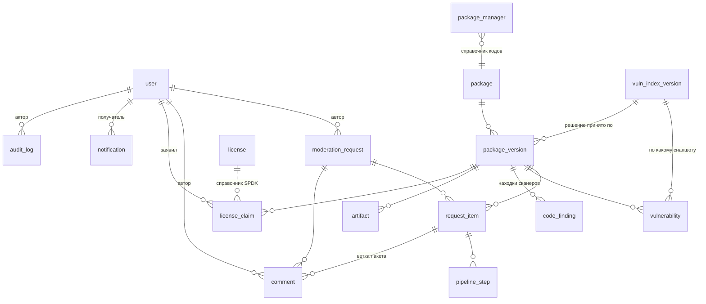

# Архитектура

## Стек: перенос на Go завершён

Backend переписан на Go для унификации технического стека DevSecOps-сервисов
организации. Python-версия и её runtime-компоненты удалены из основной ветки;
при необходимости старый код доступен в истории Git. История переноса —
[`docs/migration-to-go.md`](migration-to-go.md).

| Компонент | Было (Python-прототип) | Стало | Причина замены |
| --- | --- | --- | --- |
| Backend/API | FastAPI | Go + chi + pgx (без ORM) | единый технологический стек и явный SQL |
| Воркер конвейера | Celery | воркер на Go | Celery — Python-специфичен |
| Очередь | Redis (брокер Celery) | **Postgres**: `FOR UPDATE SKIP LOCKED` + `LISTEN/NOTIFY` | Redis ≥7.4 — SSPL, не permissive-OSS. Отдельный брокер не понадобился: состояние очереди уже живёт в базе, а отдельное хранилище создало бы второй источник правды о том, взят ли пакет в работу |
| Миграции БД | Alembic | golang-migrate, формат `NNNN_name.up/down.sql` | формат sentrix — самый стандартный из референсов |
| Карантинное хранилище | MinIO (S3) | **репозиторий в самом артефактори** | MinIO — AGPL, лицензионный риск. Файлы и так отправляются в артефактори, поэтому отдельная система со своими ключами, доступом и резервным копированием не нужна |
| Frontend (React+TS+Vite) | — | без изменений | текущий интерфейс соответствует требованиям сервиса |
| Auth (OIDC/Keycloak + локальные пользователи + RBAC) | роли из групп Keycloak | идентификация через Keycloak, роли и активность в БД сервиса | права меняются и аудируются в самом приложении |
| PostgreSQL, схема БД, конвейер шагов, роли | — | без изменений по существу | домен уже спроектирован и провалидирован |
| Конфигурация (Nexus/sandbox/OSV/лимиты) | `.env` + ручной рестарт, только чтение в UI | несекретные override в `app_setting`; Postgres `NOTIFY` атомарно заменяет runtime API и автоматически перезапускает worker, секреты остаются в окружении | один интерфейс настройки без утечки секретов, ручного обслуживания и окна 502 |

## Состав

| Компонент | Роль |
| --- | --- |
| `nginx` | единая точка входа: SPA + проксирование `/api` |
| `web` | сборка SPA (React + TypeScript, Vite), отдаётся через nginx |
| `api-go` | HTTP API целиком: заявки, статусы, решения, админка, GitLab, отчёты |
| `worker-go` | конвейер проверок, скачивание, публикация, регламентные задачи |
| `migrate-go` | разовая задача: накатывает схему и завершается |
| `db` | PostgreSQL 16 — состояние всех шагов конвейера и очередь конвейера |
| `keycloak` | IdP (профиль `sso`) |
| `nexus` | целевой артефактори (профиль `nexus`) |

Отдельного объектного хранилища (`minio`) больше нет: промежуточная зона и
отчёты живут репозиториями в самом артефактори. Очередь конвейера — в Postgres
(`FOR UPDATE SKIP LOCKED` + `LISTEN/NOTIFY`), поэтому отдельный брокер не нужен.

## Конвейер проверок

Каждый пакет заявки обрабатывается отдельно. Результат и время каждого шага
сохраняются в `pipeline_step`; в интерфейсе видно, какой шаг выполняется,
завершён или ожидает решения.

| № | Код | Назначение |
|---:|---|---|
| 0 | `db_check` | проверяет, не опубликована, не отозвана и не запрещена ли версия |
| 1 | `blacklist` | применяет правила чёрного списка до скачивания |
| 2 | `quarantine` | проверяет возраст публикации, если менеджер сообщает дату |
| 3 | `license` | определяет SPDX и создаёт запрос юристу при необходимости |
| 4 | `download` | получает точные байты и помещает их в staging Nexus |
| 5 | `dragon_scan` | передаёт артефакт и SHA-256 оркестратору Dragon |
| 6 | `vuln_scan` | сверяет PyPI/npm с локальным снапшотом OSV; результат advisory |
| 7 | `sandbox_scan` | выполняет обязательную динамическую проверку там, где она применима; для Docker отключён |
| 8 | `sbom` | формирует CycloneDX для npm, NuGet, PyPI, Maven, Go, Conan и Docker |
| 9 | `publish` | публикует в hosted-репозиторий менеджера после снятия блокировок |

Применимость лицензии, карантина, OSV, sandbox и SBOM определяется менеджером.
Неприменимый шаг сохраняется как `skipped`, а не выдаётся за успешную проверку.
OSV предупреждает о находках, но сам по себе не блокирует публикацию. Sandbox,
если он применим, нельзя обойти разрешением пропустить OSV.

Лицензионное и security-согласования независимы: пакет может одновременно
ожидать юриста и DevSecOps. `publish` проверяет все открытые блокировки и явно
пишет, чьи решения ещё нужны. Решение по версии распространяется на другие
заявки с той же версией; поздняя успешная публикация синхронизирует старые
заявки независимо от их прежней технической ошибки.

Снятые шаги `banner_scan` и `sast_scan` сохраняются только как коды истории:
они не входят в активный конвейер, но старые карточки с такими строками должны
оставаться читаемыми.

### Сверка схемы с кодом

Допустимые значения статусов и результатов шагов заданы дважды: в коде
(`internal/domain/enums.go`) и в CHECK-ограничениях базы, которые ставит
миграция. Столбцы поздних миграций (`request_item.resume_from_step`, `attempts`,
`package_version.security_override_*`) — тоже условие работы кода. Разойтись это может
запросто: миграцию забыли накатить или откатили приложение без согласованного отката схемы.

Снаружи расхождение выглядит не как «схема устарела», а как случайная ошибка при нажатии
кнопки. Так и было в бою: закрытие заявки отвечало «Заявка не закрыта» (CHECK не разрешал
статус `cancelled`), а решение DevSecOps — «Решение не применено» (в базе не было столбца
`resume_from_step`, и постановка пакета в очередь падала).

Поэтому сверка сделана в трёх местах:

* **при старте api-go** — пробелы попадают в лог с уровнем ERROR и с именем миграции
  (`repo.MissingSchemaObjects`). Не фатально: сервис обязан отвечать health и отдавать чтение
  даже на неполной схеме;
* **командой `moderation schema`** — тот же отчёт для человека, код возврата 1 при пробелах,
  так что её можно поставить в проверку перед деплоем;
* **в ответе API** — ошибки уровня схемы (SQLSTATE 23514 / 42703 / 42P01) возвращаются с
  прямым текстом «Схема базы не соответствует версии сервиса» и указанием, что покажет
  недостающее (`api.schemaError`). Имя ограничения или столбца — метаданные схемы, а не данные
  пользователя, поэтому показывать их можно.

Источник списка значений — те же константы, которыми пользуется код, поэтому сверка не может
разойтись с ним: новое значение появляется в enum'е и сразу попадает в проверку. Значение
должно быть разрешено КАЖДЫМ CHECK на столбце — после накатывания одного набора миграций
поверх базы, созданной другим, рядом может остаться второе ограничение со старым списком.

У python-версии та же сверка сделана тестом (`tests/unit/test_migration_constraints.py`):
он разбирает миграции Alembic и сравнивает списки с константами кода.

Набор golang-migrate накатывается руками (в `docker-compose.yml` мигратора для него нет),
поэтому все его `*.up.sql` написаны **безопасно повторяемыми**: `ADD COLUMN IF NOT EXISTS`,
`CREATE TABLE/INDEX IF NOT EXISTS`, а ограничения снимаются через `DROP CONSTRAINT IF EXISTS`
сразу по двум именам — своему и тому, которое даёт Alembic. Значит, «накатить весь набор» —
безопасная операция: уже применённые миграции ничего не сломают, и не нужно выяснять, какие
именно пропущены (а `moderation schema` это всё равно покажет).

### Возобновление после ручного решения

| Из состояния | Кто снимает | Возобновляется с шага |
| --- | --- | --- |
| `quarantined` | фоновая задача по истечении срока либо DevSecOps досрочно | 3 (`license`) |
| `awaiting_legal` / `license_claimed` | юрист подтвердил лицензию | 4 (`download`) |
| `awaiting_security` | DevSecOps разрешил публикацию | 4 (`download`) |

Возобновление с шага 4 после решения DevSecOps не случайно: при `fail` на шаге 5
пакет из временного репозитория удаляется сразу, поэтому артефакт скачивается
заново.

**Решение снимает блокировку не только для той заявки, где было нажато.** Если несколько
заявок (`moderation_request`, в том числе от разных авторов) ссылаются на одну и ту же
`package_version`, решение по карантину/лицензии/безопасности применяется сразу ко всем их
`request_item`, ожидающим того же шага (`siblings_awaiting`/`_apply_to_siblings`,
`app/services/decisions.py`) — не только к тому пакету, на карточке которого его приняли. Это
осознанное поведение: версия пакета одна на всех, и вопрос про её лицензию/уязвимость не имеет
смысла решать по второму разу для второй заявки. При проектировании UI очередей (`decisions.py`,
`_queue`) и уведомлений это должно быть видно — иначе пользователь, принявший решение по одной
заявке, не поймёт, почему у него пропали ещё N заявок из очереди.

Решение роли гасит блокировку своего шага — его строка отмечается пройденной. Это обязательно:
возобновление идёт с шага 4, сам шаг лицензии повторно не выполняется, и без явной отметки
публикация ждала бы вечно. По той же причине гасится досрочно снятый карантин — повторный прогон
шага 2 дал бы тот же вердикт, ведь дата публикации не изменилась.

## Жизненный цикл артефакта в артефактори

Пакет всё время лежит в артефактори, но в двух разных репозиториях: временном
(`ARTIFACT_REPO_STAGING`) — пока идут проверки, и репозитории своего менеджера
(`ARTIFACT_REPO_<MANAGER>`) — после того, как все пройдены. Временный
репозиторий — карантинная зона, а не архив.

- пакет появляется во временном репозитории на шаге скачивания, по пути
  `{manager}/{name}/{version}/{filename}`;
- после публикации переносится в репозиторий своего менеджера. По возможности —
  `api/move` самого артефактори, то есть без прогона байтов через сервис;
  где перенос не поддерживается, сервис перекладывает скачиванием и выгрузкой;
- удаляется из временного репозитория сразу после переноса и сразу при
  отклонении пакета — и проверками, и человеком;
- зависшие дольше `STAGING_ORPHAN_TTL_HOURS` добивает регламентная уборка
  (прежнее имя `S3_ORPHAN_TTL_HOURS` продолжает приниматься).

## Схема БД


```mermaid
erDiagram
    user ||--o{ moderation_request : "автор"
    user ||--o{ comment : "автор"
    user ||--o{ license_claim : "заявил"
    user ||--o{ notification : "получатель"
    user ||--o{ audit_log : "актор"
    package_manager }o--|| package : "справочник кодов"
    package ||--o{ package_version : ""
    package_version ||--o{ request_item : ""
    package_version ||--o{ vulnerability : ""
    package_version ||--o{ code_finding : "находки сканеров"
    package_version ||--o{ artifact : ""
    package_version ||--o{ license_claim : ""
    vuln_index_version ||--o{ vulnerability : "по какому снапшоту"
    vuln_index_version ||--o{ package_version : "решение принято по"
    moderation_request ||--o{ request_item : ""
    moderation_request ||--o{ comment : ""
    request_item ||--o{ pipeline_step : ""
    request_item ||--o{ comment : "ветка пакета"
    license ||..o{ license_claim : "справочник SPDX"
```

### Сущности

| Таблица | Назначение | Ключевые поля |
| --- | --- | --- |
| `user` | пользователи и сервисные учётки | `subject` (sub из OIDC), `roles` (JSON), `gitlab_*_token_enc` (Fernet) |
| `package_manager` | справочник менеджеров | `code`, `entry_format`, `enabled` |
| `package` | пакет без версии | уникальность `(manager, name)`, `confirmed_license_spdx` |
| `package_version` | версия пакета — центральная сущность | уникальность `(package_id, version)`, `status`, `status_reason`, `published_at`, `quarantine_until`, `license_spdx`, `license_source`, `license_raw`, `max_vuln_score`, `vuln_index_version_id`, `approved_at`, `revoked_at`, `security_override_at`/`_by_id`/`_comment` (см. ниже) |
| `moderation_request` | заявка | `author_id`, `manager`, `status`, `source`, `idempotency_key` (unique), `origin_file`, `reason`, `author_role`, `include_transitive`, `warnings` (JSON) |
| `request_item` | пакет внутри заявки | `status`, `requested_name`, `requested_version`, `dependency_kind`, `current_step`, `next_action` («Что делать»), `blocked_reason`, `waiting_since`, `finished_at` |
| `pipeline_step` | шаг конвейера | уникальность `(request_item_id, step_code)`, `result`, `message`, `details` (JSON), `started_at`, `finished_at` |
| `vulnerability` | найденная уязвимость | `external_id` (CVE/GHSA), `cvss_vector`, `cvss_score`, `score` (0..100), `fixed_versions`, `vuln_index_version_id` |
| `code_finding` | находка сканера содержимого: политический баннер или SAST | `scanner` (yara/semgrep), `rule_id`, `severity`, `file_path`, `line`, `matched` |
| `vuln_index_version` | версия снапшота OSV | `version`, `checksum`, `published_at`, `record_count`, `is_active` |
| `license` | справочник SPDX | `spdx_id`, `allowed` |
| `license_claim` | заявление лицензии разработчиком | `url`, `snapshot_text`, `spdx_id`, `status`, `decided_by_id` |
| `comment` | обсуждение заявки и её пакетов | `request_item_id` (NULL = ветка заявки), `mentions`, `is_edited`, `deleted_at` |
| `artifact` | артефакт | `filename`, `source_url`, `size_bytes`, `s3_bucket`, `s3_key`, `s3_uploaded_at`, `s3_deleted_at`, `nexus_url`, `sha256`, `checksum_algo`, `declared_checksum`, `status`, `published_at` |
| `notification` | уведомление внутри сервиса | `event`, `read_at` |
| `audit_log` | аудит | `actor_name`, `action`, `entity_type/id`, `old_value`, `new_value`, `source`, `request_id` |

Индексы: `package.name`, `package_version.status`, `package_version.quarantine_until`,
`request_item.status`, `request_item.request_id`, `moderation_request.status`,
`vulnerability.external_id`, `notification(user_id, read_at)`, `audit_log(entity_type, entity_id)`,
`audit_log.created_at`.

Типы намеренно переносимые (`JSON` вместо `JSONB`, строки + `CHECK` вместо PG ENUM): один и тот же
код работает на PostgreSQL в бою и на SQLite в юнит-тестах. Допустимые значения перечислены в
`app/db/enums.py`.

### Статусы

`package_version.status`: `new`, `checking`, `quarantined`, `awaiting_legal`, `license_claimed`,
`awaiting_security`, `approved`, `rejected`, `revoked`, `blacklisted`, `failed`.

`moderation_request.status` (агрегат по пакетам): `pending`, `quarantined`, `awaiting_legal`,
`awaiting_security`, `approved`, `partially_approved`, `dry_run`, `rejected`, `cancelled`,
`failed`.

`request_item.status` — более гранулярный, чем агрегат заявки: помимо статусов версии пакета
включает `queued`/`running` (пока идёт конвейер), `license_claimed` (лицензия заявлена
разработчиком, ждёт решения юриста) и `cancelled` (автор закрыл заявку — пакет больше не
нужен). `recompute_request_status` сворачивает статусы всех `request_item` заявки в один
статус `moderation_request` по приоритету: `queued`/`running` → `awaiting_security` →
`awaiting_legal`/`license_claimed` → `quarantined` → `approved` → `dry_run` →
`partially_approved` → `failed` → `rejected`. Это единственное место, где определён порядок
приоритета — при добавлении нового статуса его нужно вписать в эту функцию явно, иначе заявка с
пакетом в новом статусе агрегируется непредсказуемо.

`cancelled` в свёртке не участвует вовсе: отменённые пакеты исключаются из выборки, и если
отменены все — заявка получает статус `cancelled`. Иначе закрытая автором заявка уезжала бы
в `rejected`, то есть выглядела бы как запрет со стороны роли. Отмена — не удаление: строки,
аудит и обсуждение остаются.

## Интерфейсы адаптеров

Все внешние системы спрятаны за абстракциями — их можно заменить, не трогая бизнес-логику.

### `ArtifactStore` (`backend-go/internal/artifactstore`)

Реализации: `NexusArtifactStore` (Sonatype Nexus 3, один инстанс на все менеджеры: hosted-репозиторий
на каждый менеджер плюс raw-репозиторий со снапшотами OSV) и `GenericArtifactStore` (внешний
Artifactory: базовый URL, `basic`/`token`, шаблоны путей на каждый менеджер). Выбор выполняется
по `ARTIFACT_STORE`.

Разница между ними не косметическая, и перепутать их нельзя: Nexus принимает пакет только
компонентным API (`POST /service/rest/v1/components?repository=…`, multipart, имя поля зависит от
формата: `pypi.asset`, `npm.asset`, `nuget.asset`, `raw.asset1` + `raw.directory` для go-модулей),
а раскладку внутри репозитория строит сам. На `PUT` по адресу файла — то есть на способ
Artifactory — он отвечает `405 Method Not Allowed`.

### Индекс уязвимостей (`backend-go/internal/osv`)

Реализации: `OsvSnapshotIndex` (боевая: забирает снапшот из `ARTIFACT_REPO_OSV` тем же
`ArtifactStore`, проверяет контрольную сумму, распаковывает локально) и `OsvApiIndex` (только для
локальной разработки, `OSV_SOURCE=api`).

### Уведомления (`backend-go/internal/repo/social.go`)

Единственная реализация — `InAppNotifier`. Список событий: `request_awaits_security`,
`request_awaits_legal`, `license_claimed`, `comment_added`, `decision_made`,
`quarantine_released`, `package_revoked`, `package_approved`, `pipeline_failed`. Добавление
внешнего канала потребует отдельного адаптера, но не изменения правил назначения получателей.

### Плагины менеджеров (`backend-go/internal/registry`)

| Менеджер | Формат записи | Файлы зависимостей | Экосистема OSV |
| --- | --- | --- | --- |
| `pypi` | `name==version` | `requirements*.txt`, `poetry.lock`, `pyproject.toml` | `PyPI` |
| `npm` | `[@scope/]name@version` | `package-lock.json`, `yarn.lock`, `package.json` | `npm` |
| `go` | `module@vX.Y.Z` | `go.mod`, `go.sum` | `Go` |
| `nuget` | `Id@version` | `packages.lock.json`, `packages.config`, `*.csproj` | `NuGet` |

Раскрытие транзитивных зависимостей — `backend-go/internal/resolve` поверх
`internal/version` (сравнение версий и разбор диапазонов по правилам каждой экосистемы) и
`Requirements`/`Versions` у плагинов менеджеров. Реестровое раскрытие включено для PyPI, npm,
Go, NuGet, Conan, LuaRocks, Maven, Composer и Terraform; исключения только Docker, Git и Files.
Maven строит effective POM с учётом parent, `dependencyManagement`, свойств и импортируемых BOM.
Обход идёт вширь с пределами по глубине и
размеру; узел приводится к точной версии по правилам менеджера (npm, pip, Maven, Composer,
LuaRocks и Terraform берут максимальную подходящую, NuGet — минимальную, Go не выбирает).
Конфликты версий не разрешаются: обе версии
попадают в заявку и называются конфликтом — выбирать за разработчика сервис не вправе.

Парсеры различают прямые и транзитивные зависимости (`// indirect` в go.mod, `type: Transitive` в
packages.lock.json, корневой `packages[""]` в package-lock.json). Транзитивные автоматически не
подтягиваются.

## Наблюдаемость и устойчивость

- Структурные JSON-логи содержат `request_id`; nginx возвращает его в
  `X-Request-Id`.
- `/metrics` отдаёт метрики HTTP, шагов конвейера, внешних вызовов, возраста
  OSV, очереди и сторожа.
- `/health` проверяет API и PostgreSQL; состояние worker доступно также через
  `/api/v1/system/status`.
- Внешние вызовы используют таймауты, повторные попытки и circuit breaker.
- Недоступный обязательный сканер не трактуется как результат «чисто».

### Очередь и восстановление

Заявка создаётся синхронно, после чего `worker-go` забирает элементы из
PostgreSQL атомарно через `FOR UPDATE SKIP LOCKED`. `LISTEN/NOTIFY` будит
worker сразу после постановки элемента, а периодический опрос страхует от
потерянного уведомления. Отдельного брокера и Redis нет.

Сторож очереди ищет элементы, которые слишком долго остаются в `queued` или
`running`, и возвращает их в обработку по правилам попыток. Атомарный захват
не позволяет двум worker одновременно опубликовать один элемент. Для ручной
диагностики используются:

```bash
docker compose run --rm worker-go worker --once
curl -fsS https://<host>/api/v1/system/status
```

### Работа с недоверенными артефактами

Скачанный файл сначала попадает в staging Nexus и получает SHA-256. Dragon,
sandbox и генератор SBOM работают именно с этими байтами. При распаковке
проверяются выход пути за рабочий каталог, ссылки, число файлов, размер файла
и общий распакованный объём. Публикация использует тот же артефакт, который
прошёл проверки.

### Конфигурация без ручного рестарта

Несекретные web-настройки хранятся в `app_setting`. API применяет новый
снимок конфигурации атомарно и отправляет PostgreSQL `NOTIFY`; `worker-go`
завершает текущую операцию и автоматически перезапускается с новой
конфигурацией. Секреты и bootstrap-параметры остаются в окружении.

`LOCAL_AUTH_SECRET` нельзя оставлять равным примеру из `.env.example` при
включённом локальном входе в production.
